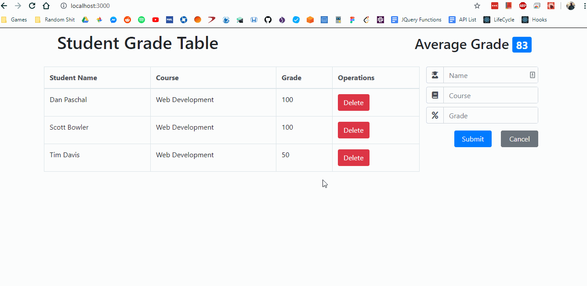
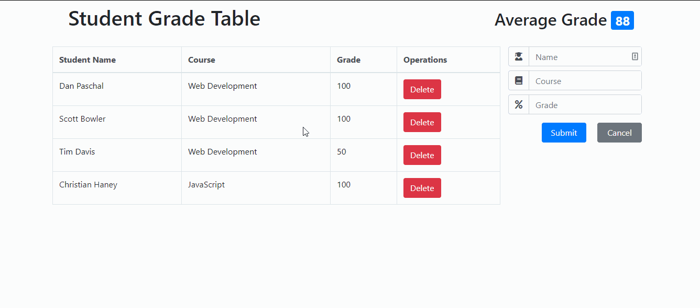
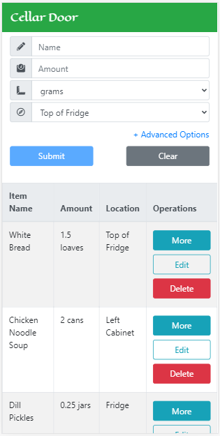

# Student Grade Table
A Full-Stack, React/PHP based web application for teachers who want to manage student grade data

## Technologies Utilized
- React.js
- Express.js
- MySQL
- HTML5
- Bootstrap 4
- CSS3
- Webpack 4

## Live Demo Link
- Try the application at: https://sgt.christian-haney.com

## Features
- Teachers can view a table of all student grade data
- Teachers can view the average of all stored grades
- Teachers can add a grade record to the database
- Teachers can remove a grade record from the database

## Previews
#### Adding a Grade

#### Deleting a Grade

#### Mobile View


## Installation
#### System Requirements
- Node.js

#### Getting Started
1. Clone this repository into the desired directory
```
git clone https://github.com/Coding-Christian/student-grade-table
```
2. Navigate to the root of the cloned repository
```
cd sutdent-grade-table
```
3. Install required dependencies with npm
```
npm install --all
```
4. Bundle the application using webpack and npm
```
npm run build
```
5. Start the webpack dev server using npm
```
npm run dev
```
6. Navigate to `https://localhost:3000` in your preferred web browser
