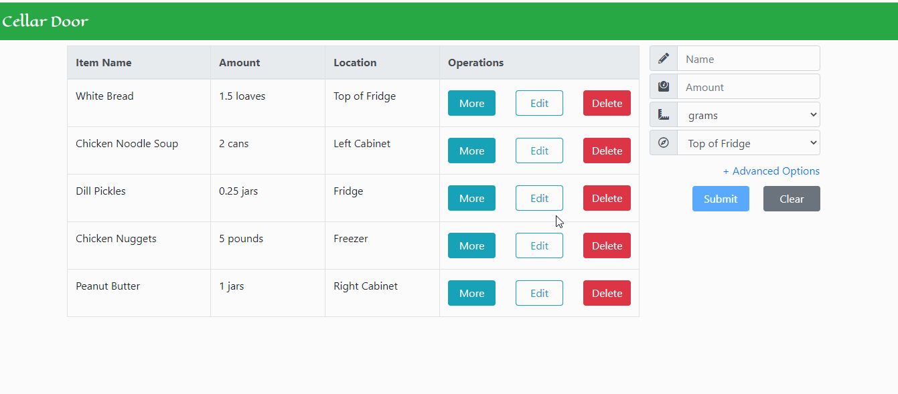
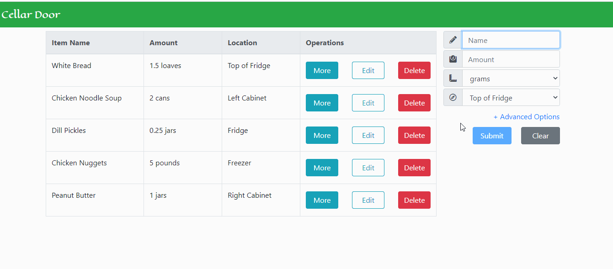
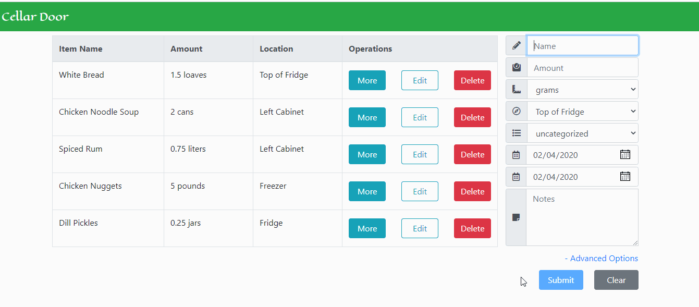
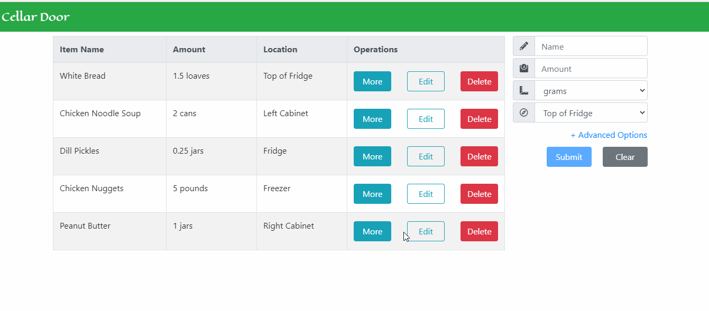
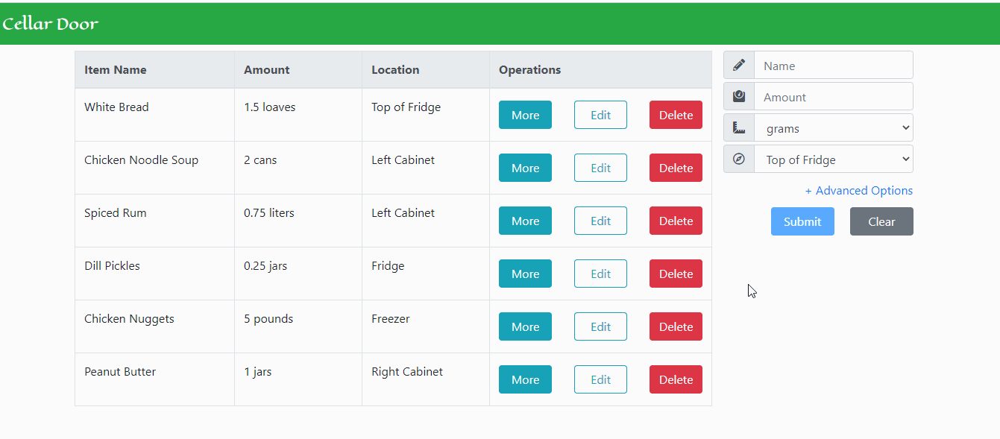

`# Cellar Door
A Full-Stack, React/Node based web application for shoppers who want to keep track of their groceries

## Technologies Utilized
- React.js
- Express.js
- MySQL
- AWS EC2
- Apache2
- HTML5
- Bootstrap 4
- CSS3
- Webpack 4

## Live Demo Link
- Try the application at: https://sgt.christian-haney.com

## Features
- Shoppers can view a table with basic information of all grocery items
- Shoppers can view the advanced details of a grocery item
- Shoppers can add a grocery item with basic information to the database
- Shoppers can add a grocery item with advanced information to the database
- Shoppers can modify the details of a grocery item
- Shoppers can remove a grocery item from the database

## Previews
#### Viewing Details of a Grocery Item

#### Adding a Grocery Item (Basic)

#### Adding a Grocery Item (Advanced)

#### Editing a Grocery Item

#### Deleting a Grocery Item

#### Mobile View


## Installation
#### System Requirements
- Node.js
- mysql
- apache2

#### Getting Started
1. Clone this repository into the desired directory
```
git clone https://github.com/Coding-Christian/student-grade-table
```
2. Navigate to the root of the cloned repository
```
cd student-grade-table
```
3. Install required dependencies with npm
```
npm install --all
```
4. Bundle the application using webpack and npm
```
npm run build
```
5. Start the webpack dev server using npm
```
npm run dev
```
6. Navigate to `https://localhost:3000` in your preferred web browser
`
